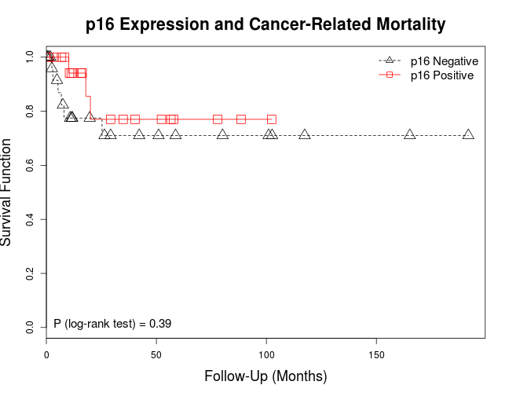

# HPV & p16INK4a Expression in Penile Cancer
Last update: ``Tue Jul 22 15:14:21 2014``


```r
library(knitr)
opts_chunk$set(echo = FALSE, message = FALSE, warning = FALSE, cache = FALSE, fig.height = 7, fig.width = 9)
```

## 1) Preprocesing the dataset for analysis
* Loading the libraries and functions that will be used

```r
source("../StandardAnalysis.R")
source("../SurvivalPlot.R")
library(foreign)
library(survival)
```

* Loading the full dataset, selecting relevant clinicopathologic variables for data analysis, and selecting markers under evaluation. The dataset was updated using the "penile tma 6-11-14.dta" sent by Mark Ball, M.D. (Department of Urology, The Johns Hopkins University) on 06/11/2014 09:18 AM. Creating working dataset for the project with all cases and only invasive cases, and dropping unused levels from factor variables.

```r
# Loading the STATA dataset
penis.full <- read.dta("../penile tma 6-11-14 stata 12.dta", convert.underscore = TRUE)
# Selecting clinicopathologic variables from the full dataset
clinicopath <- c("age", "race", "invasive", "subtype", "site", "grade", "thick", "lvi", "pni", "level", "urethra", "nodes", "date.lymph.mo", "dissection.type", "tnm.tumor", "tnm.nodes", "stage", "treatment", "chemo", "radio", "recurrence", "progression", "mets", "dead", "died.disease", "outcome", "date.recurrence.mo", "date.progression.mo", "date.met.mo", "date.death.mo", "fu.last.mo")
# Selecting markers from the full dataset
markers <- c("hpv.pos", "p16.pos")
# Creating the dataset using the selected clinicopathologic variables and markers
penis.all <- penis.full[c(clinicopath, markers)]
# Selecting only invasive cases and dropping unused levels
penis.data <- subset(penis.all, invasive == "Yes", select = -invasive)
penis.data <- droplevels(penis.data)
# Saving the dataset that is used for analysis
write.csv(penis.data, "PenisDataset.csv")
```
From now on the analysis will be carried out taking into account only the invasive cases.

***

## 2) DESCRIPTIVE ANALYSIS
### 2.1) Describing the dataset
#### 2.1.1) Clinical Features
* Patient's age

```
##        Values
## Mean     65.8
## SD       12.0
## Median   65.0
## IQR      18.0
```
* Patient's race

```
##                  Count Percentages
## Caucasian           37        69.8
## African-American    12        22.6
## Other                4         7.5
```
#### 2.1.2) Pathologic Features
* Histologic subtype

```
##                    Count Percentages
## Usual SCC             33        62.3
## Warty SCC              5         9.4
## Basaloid SCC           6        11.3
## Warty-Basaloid SCC     2         3.8
## Verrucous SCC          3         5.7
## Papillary SCC          2         3.8
## Other Subtype          2         3.8
```
* Anatomical site

```
##                Count Percentages
## Glans             28        52.8
## Inner Foreskin     1         1.9
## Shaft             16        30.2
## Urethra            8        15.1
```
* Anatomical level

```
##                                  Count Percentages
## Lamina Propria                      20        37.7
## Corpus Spongiosum/Dartos            15        28.3
## Corpus Cavernosum/Preputial Skin    10        18.9
## Urethra                              6        11.3
## Adjacent Structures                  1         1.9
## <NA>                                 1         1.9
```
* Histologic grade

```
##   Count Percentages
## 1    11        20.8
## 2    24        45.3
## 3    18        34.0
```
* Tumor thickness (mm)

```
##         Count Percentages
## < 5mm      21        39.6
## 5-10 mm    16        30.2
## >10 mm     16        30.2
```
* Tumor invasion of penile urethra

```
##     Count Percentages
## No     43        81.1
## Yes    10        18.9
```
* Lymphovascular invasion

```
##     Count Percentages
## No     36        67.9
## Yes    17        32.1
```
* Perineural invasion

```
##     Count Percentages
## No     36        67.9
## Yes    17        32.1
```
* Pathologic pT stage

```
##     Count Percentages
## Ta      1         1.9
## T1a    19        35.8
## T1b     1         1.9
## T2     22        41.5
## T3      9        17.0
## T4      1         1.9
```
* Pathologic pN stage

```
##      Count Percentages
## pN0     13        24.5
## pN1      5         9.4
## pN2      4         7.5
## pN3      7        13.2
## <NA>    24        45.3
```
* Clinical stage

```
##            Count Percentages
## Stage 0        1         1.9
## Stage I       18        34.0
## Stage II      18        34.0
## Stage IIIa     5         9.4
## Stage IIIb     2         3.8
## Stage IV       9        17.0
```
* Inguinal lymph node dissection

```
##               Count Percentages
## Prophylactic     10        18.9
## Post-Surgical    12        22.6
## <NA>             31        58.5
```
* Positive (metastatic) inguinal lymph nodes

```
##          Count Percentages
## Negative    13        24.5
## Positive    16        30.2
## <NA>        24        45.3
```
* Time from treatment to lymphadenectomy

```
##        Values
## Mean      2.2
## SD        3.8
## Median    1.0
## IQR       1.7
```
#### 2.1.3) Treatment
* Primary treatment

```
##                     Count Percentages
## Partial Penectomy      48        90.6
## Pelvic Exenteration     2         3.8
## Shave Biopsy            1         1.9
## Total Penectomy         2         3.8
```
* Adjuvant chemotherapy

```
##      Count Percentages
## No      40        75.5
## Yes      6        11.3
## <NA>     7        13.2
```
* Adjuvan radiotherapy

```
##      Count Percentages
## No      43        81.1
## Yes      6        11.3
## <NA>     4         7.5
```
#### 2.1.4) Outcome
* Tumor recurrence

```
##      Count Percentages
## No      40        75.5
## Yes      4         7.5
## <NA>     9        17.0
```
* Time from primary treatment to tumor recurrence

```
##        Values
## Mean     20.5
## SD       23.7
## Median   13.3
## IQR      20.8
```
* Tumor progression

```
##      Count Percentages
## No      29        54.7
## Yes     18        34.0
## <NA>     6        11.3
```
* Time from primary treatment to tumor progression

```
##        Values
## Mean      9.8
## SD        9.0
## Median    6.0
## IQR      13.3
```
* Distant (visceral) metastasis

```
##      Count Percentages
## No      26        49.1
## Yes     19        35.8
## <NA>     8        15.1
```
* Time from primary treatment to distant metastasis

```
##        Values
## Mean      9.8
## SD        7.0
## Median   10.7
## IQR      13.1
```
* Patient's outcome

```
##                       Count Percentages
## Died of Disease          11        20.8
## Died of other Causes     15        28.3
## Alive with Disease       10        18.9
## Alive with No Disease    16        30.2
## No Follow-Up              1         1.9
```
Total follow-up time (months)

```
##        Values
## Mean     37.2
## SD       43.5
## Median   17.9
## IQR      47.2
```
#### 2.1.5) Markers
* HPV status

```
##     Count Percentages
## No     45        84.9
## Yes     8        15.1
```
* p16INK4a overexpression

```
##      Count Percentages
## No      29        54.7
## Yes     23        43.4
## <NA>     1         1.9
```
***

### 2.2) Association between HPV status and clinicopathological/outcome features
For the columns, "No" indicates HPV negative and "Yes" indicates HPV positive status. To control for family-wise error rates adjusted P values using Hommel's correction are provided in section 2.2.4)

#### 2.2.1) Clinical features
* Patient's age and HPV

```
##        No  Yes
## Median 65 70.0
## IQR    18 16.8
## 
## Mann-Whitney's P value = 0.4632
```
* Patient's race and HPV

```
## **Table of Frequencies**
##                   Column
## Row                No Yes
##   Caucasian        30   7
##   African-American 11   1
##   Other             4   0
## 
## **Row Percentages**
##                   Column
## Row                 No Yes
##   Caucasian         81  19
##   African-American  92   8
##   Other            100   0
## 
## **Column Percentages**
##                   Column
## Row                No Yes
##   Caucasian        67  88
##   African-American 24  12
##   Other             9   0
## 
## Fisher's P value = 0.8269
```
#### 2.2.2) Pathologic features
* Histologic subtype and HPV

```
## **Table of Frequencies**
##                     Column
## Row                  No Yes
##   Usual SCC          31   2
##   Warty SCC           5   0
##   Basaloid SCC        1   5
##   Warty-Basaloid SCC  1   1
##   Verrucous SCC       3   0
##   Papillary SCC       2   0
##   Other Subtype       2   0
## 
## **Row Percentages**
##                     Column
## Row                   No Yes
##   Usual SCC           94   6
##   Warty SCC          100   0
##   Basaloid SCC        17  83
##   Warty-Basaloid SCC  50  50
##   Verrucous SCC      100   0
##   Papillary SCC      100   0
##   Other Subtype      100   0
## 
## **Column Percentages**
##                     Column
## Row                  No Yes
##   Usual SCC          69  25
##   Warty SCC          11   0
##   Basaloid SCC        2  62
##   Warty-Basaloid SCC  2  12
##   Verrucous SCC       7   0
##   Papillary SCC       4   0
##   Other Subtype       4   0
## 
## Fisher's P value = 0.0009336
```
* Anatomical site and HPV

```
## **Table of Frequencies**
##                 Column
## Row              No Yes
##   Glans          26   2
##   Inner Foreskin  0   1
##   Shaft          13   3
##   Urethra         6   2
## 
## **Row Percentages**
##                 Column
## Row               No Yes
##   Glans           93   7
##   Inner Foreskin   0 100
##   Shaft           81  19
##   Urethra         75  25
## 
## **Column Percentages**
##                 Column
## Row              No Yes
##   Glans          58  25
##   Inner Foreskin  0  12
##   Shaft          29  38
##   Urethra        13  25
## 
## Fisher's P value = 0.07031
```
* Anatomical level and HPV

```
## **Table of Frequencies**
##                                   Column
## Row                                No Yes
##   Lamina Propria                   19   1
##   Corpus Spongiosum/Dartos         12   3
##   Corpus Cavernosum/Preputial Skin  7   3
##   Urethra                           5   1
##   Adjacent Structures               1   0
## 
## **Row Percentages**
##                                   Column
## Row                                 No Yes
##   Lamina Propria                    95   5
##   Corpus Spongiosum/Dartos          80  20
##   Corpus Cavernosum/Preputial Skin  70  30
##   Urethra                           83  17
##   Adjacent Structures              100   0
## 
## **Column Percentages**
##                                   Column
## Row                                No Yes
##   Lamina Propria                   43  12
##   Corpus Spongiosum/Dartos         27  38
##   Corpus Cavernosum/Preputial Skin 16  38
##   Urethra                          11  12
##   Adjacent Structures               2   0
## 
## Fisher's P value = 0.3467
```
* Histologic grade and HPV

```
## **Table of Frequencies**
##    Column
## Row No Yes
##   1 11   0
##   2 22   2
##   3 12   6
## 
## **Row Percentages**
##    Column
## Row  No Yes
##   1 100   0
##   2  92   8
##   3  67  33
## 
## **Column Percentages**
##    Column
## Row No Yes
##   1 24   0
##   2 49  25
##   3 27  75
## 
## Fisher's P value = 0.03203
```
* Tumor thickness and HPV

```
## **Table of Frequencies**
##          Column
## Row       No Yes
##   < 5mm   18   3
##   5-10 mm 13   3
##   >10 mm  14   2
## 
## **Row Percentages**
##          Column
## Row       No Yes
##   < 5mm   86  14
##   5-10 mm 81  19
##   >10 mm  88  12
## 
## **Column Percentages**
##          Column
## Row       No Yes
##   < 5mm   40  38
##   5-10 mm 29  38
##   >10 mm  31  25
## 
## Fisher's P value = 1
```
* Tumor invasion of penile urethra and HPV

```
## **Table of Frequencies**
##      Column
## Row   No Yes
##   No  37   6
##   Yes  8   2
## 
## **Row Percentages**
##      Column
## Row   No Yes
##   No  86  14
##   Yes 80  20
## 
## **Column Percentages**
##      Column
## Row   No Yes
##   No  82  75
##   Yes 18  25
## 
## Fisher's P value = 0.6364
```
* Lymphovascular invasion and HPV

```
## **Table of Frequencies**
##      Column
## Row   No Yes
##   No  35   1
##   Yes 10   7
## 
## **Row Percentages**
##      Column
## Row   No Yes
##   No  97   3
##   Yes 59  41
## 
## **Column Percentages**
##      Column
## Row   No Yes
##   No  78  12
##   Yes 22  88
## 
## Fisher's P value = 0.0008174
```
* Perineural invasion and HPV

```
## **Table of Frequencies**
##      Column
## Row   No Yes
##   No  29   7
##   Yes 16   1
## 
## **Row Percentages**
##      Column
## Row   No Yes
##   No  81  19
##   Yes 94   6
## 
## **Column Percentages**
##      Column
## Row   No Yes
##   No  64  88
##   Yes 36  12
## 
## Fisher's P value = 0.4119
```
* Pathological T stage and HPV

```
## **Table of Frequencies**
##      Column
## Row   No Yes
##   Ta   1   0
##   T1a 19   0
##   T1b  0   1
##   T2  16   6
##   T3   8   1
##   T4   1   0
## 
## **Row Percentages**
##      Column
## Row    No Yes
##   Ta  100   0
##   T1a 100   0
##   T1b   0 100
##   T2   73  27
##   T3   89  11
##   T4  100   0
## 
## **Column Percentages**
##      Column
## Row   No Yes
##   Ta   2   0
##   T1a 42   0
##   T1b  0  12
##   T2  36  75
##   T3  18  12
##   T4   2   0
## 
## Fisher's P value = 0.02969
```
* Pathological N stage and HPV

```
## **Table of Frequencies**
##      Column
## Row   No Yes
##   pN0 11   2
##   pN1  4   1
##   pN2  4   0
##   pN3  5   2
## 
## **Row Percentages**
##      Column
## Row    No Yes
##   pN0  85  15
##   pN1  80  20
##   pN2 100   0
##   pN3  71  29
## 
## **Column Percentages**
##      Column
## Row   No Yes
##   pN0 46  40
##   pN1 17  20
##   pN2 17   0
##   pN3 21  40
## 
## Fisher's P value = 0.8238
```
* Clinical stage and HPV

```
## **Table of Frequencies**
##             Column
## Row          No Yes
##   Stage 0     1   0
##   Stage I    18   0
##   Stage II   13   5
##   Stage IIIa  4   1
##   Stage IIIb  2   0
##   Stage IV    7   2
## 
## **Row Percentages**
##             Column
## Row           No Yes
##   Stage 0    100   0
##   Stage I    100   0
##   Stage II    72  28
##   Stage IIIa  80  20
##   Stage IIIb 100   0
##   Stage IV    78  22
## 
## **Column Percentages**
##             Column
## Row          No Yes
##   Stage 0     2   0
##   Stage I    40   0
##   Stage II   29  62
##   Stage IIIa  9  12
##   Stage IIIb  4   0
##   Stage IV   16  25
## 
## Fisher's P value = 0.1487
```
* Inguinal lymph node dissection and HPV

```
## **Table of Frequencies**
##                Column
## Row             No Yes
##   Prophylactic   8   2
##   Post-Surgical  9   3
## 
## **Row Percentages**
##                Column
## Row             No Yes
##   Prophylactic  80  20
##   Post-Surgical 75  25
## 
## **Column Percentages**
##                Column
## Row             No Yes
##   Prophylactic  47  40
##   Post-Surgical 53  60
## 
## Fisher's P value = 1
```
* Metastatic inguinal lymph nodes and HPV

```
## **Table of Frequencies**
##           Column
## Row        No Yes
##   Negative 11   2
##   Positive 13   3
## 
## **Row Percentages**
##           Column
## Row        No Yes
##   Negative 85  15
##   Positive 81  19
## 
## **Column Percentages**
##           Column
## Row        No Yes
##   Negative 46  40
##   Positive 54  60
## 
## Fisher's P value = 1
```
#### 2.2.3) Outcome
* Tumor recurrence and HPV

```
## **Table of Frequencies**
##      Column
## Row   No Yes
##   No  34   6
##   Yes  2   2
## 
## **Row Percentages**
##      Column
## Row   No Yes
##   No  85  15
##   Yes 50  50
## 
## **Column Percentages**
##      Column
## Row   No Yes
##   No  94  75
##   Yes  6  25
## 
## Fisher's P value = 0.1453
```
* Tumor progression and HPV

```
## **Table of Frequencies**
##      Column
## Row   No Yes
##   No  25   4
##   Yes 14   4
## 
## **Row Percentages**
##      Column
## Row   No Yes
##   No  86  14
##   Yes 78  22
## 
## **Column Percentages**
##      Column
## Row   No Yes
##   No  64  50
##   Yes 36  50
## 
## Fisher's P value = 0.6918
```
* Distant metastasis and HPV

```
## **Table of Frequencies**
##      Column
## Row   No Yes
##   No  23   3
##   Yes 14   5
## 
## **Row Percentages**
##      Column
## Row   No Yes
##   No  88  12
##   Yes 74  26
## 
## **Column Percentages**
##      Column
## Row   No Yes
##   No  62  38
##   Yes 38  62
## 
## Fisher's P value = 0.2528
```
* Overall mortality and HPV

```
## **Table of Frequencies**
##      Column
## Row   No Yes
##   No  23   4
##   Yes 20   4
## 
## **Row Percentages**
##      Column
## Row   No Yes
##   No  85  15
##   Yes 83  17
## 
## **Column Percentages**
##      Column
## Row   No Yes
##   No  53  50
##   Yes 47  50
## 
## Fisher's P value = 1
```
Cancer-related mortality and HPV

```
## **Table of Frequencies**
##      Column
## Row   No Yes
##   No  35   6
##   Yes  7   2
## 
## **Row Percentages**
##      Column
## Row   No Yes
##   No  85  15
##   Yes 78  22
## 
## **Column Percentages**
##      Column
## Row   No Yes
##   No  83  75
##   Yes 17  25
## 
## Fisher's P value = 0.6231
```
#### 2.2.4) Adjusted P values
In this section we provide the adjusted P values for the preceding tests using Hommel's correction.

```
##                          Raw P values Adjusted P values
## Patient's age               0.4632000           1.00000
## Patient's race              0.8269000           1.00000
## Histologic subtype          0.0009336           0.01774
## Anatomical site             0.0703100           1.00000
## Anatomical level            0.3467000           1.00000
## Histologic grade            0.0320300           0.54451
## Tumor thickness             1.0000000           1.00000
## Urethra invasion            0.6364000           1.00000
## Lymphovascular invasion     0.0008174           0.01553
## Perineural invasion         0.4119000           1.00000
## pT stage                    0.0296900           0.50473
## pN stage                    0.8238000           1.00000
## Clinical stage              0.1487000           1.00000
## Inguinal node dissection    1.0000000           1.00000
## Nodal metastasis            1.0000000           1.00000
## Tumor recurrence            0.1453000           1.00000
## Tumor progression           0.6918000           1.00000
## Distant metastasis          0.2528000           1.00000
## Overall mortality           1.0000000           1.00000
## Cancer-related mortality    0.6231000           1.00000
```
***

### 2.3) Association between p16INK4a overexpression and clinicopathological/outcome features
For the columns, "No" indicates no p16INK4a overexpression and "Yes" indicates p16INK4a overexpression. To control for family-wise error rates adjusted P values using Hommel's correction are provided in section 2.3.4)

#### 2.3.1) Clinical features
* Patient's age and p16INK4a

```
##        No Yes
## Median 66  62
## IQR    17  19
## 
## Mann-Whitney's P value = 0.2606
```
* Patient's race and p16INK4a

```
## **Table of Frequencies**
##                   Column
## Row                No Yes
##   Caucasian        25  12
##   African-American  1  10
##   Other             3   1
## 
## **Row Percentages**
##                   Column
## Row                No Yes
##   Caucasian        68  32
##   African-American  9  91
##   Other            75  25
## 
## **Column Percentages**
##                   Column
## Row                No Yes
##   Caucasian        86  52
##   African-American  3  43
##   Other            10   4
## 
## Fisher's P value = 0.001199
```
#### 2.3.2) Pathologic features
* Histologic subtype and p16INK4a

```
## **Table of Frequencies**
##                     Column
## Row                  No Yes
##   Usual SCC          20  12
##   Warty SCC           3   2
##   Basaloid SCC        0   6
##   Warty-Basaloid SCC  0   2
##   Verrucous SCC       3   0
##   Papillary SCC       2   0
##   Other Subtype       1   1
## 
## **Row Percentages**
##                     Column
## Row                   No Yes
##   Usual SCC           62  38
##   Warty SCC           60  40
##   Basaloid SCC         0 100
##   Warty-Basaloid SCC   0 100
##   Verrucous SCC      100   0
##   Papillary SCC      100   0
##   Other Subtype       50  50
## 
## **Column Percentages**
##                     Column
## Row                  No Yes
##   Usual SCC          69  52
##   Warty SCC          10   9
##   Basaloid SCC        0  26
##   Warty-Basaloid SCC  0   9
##   Verrucous SCC      10   0
##   Papillary SCC       7   0
##   Other Subtype       3   4
## 
## Fisher's P value = 0.005738
```
* Anatomical site and p16INK4a

```
## **Table of Frequencies**
##                 Column
## Row              No Yes
##   Glans          18   9
##   Inner Foreskin  0   1
##   Shaft           8   8
##   Urethra         3   5
## 
## **Row Percentages**
##                 Column
## Row               No Yes
##   Glans           67  33
##   Inner Foreskin   0 100
##   Shaft           50  50
##   Urethra         38  62
## 
## **Column Percentages**
##                 Column
## Row              No Yes
##   Glans          62  39
##   Inner Foreskin  0   4
##   Shaft          28  35
##   Urethra        10  22
## 
## Fisher's P value = 0.2485
```
* Anatomical level and p16INK4a

```
## **Table of Frequencies**
##                                   Column
## Row                                No Yes
##   Lamina Propria                   14   5
##   Corpus Spongiosum/Dartos          5  10
##   Corpus Cavernosum/Preputial Skin  6   4
##   Urethra                           3   3
##   Adjacent Structures               0   1
## 
## **Row Percentages**
##                                   Column
## Row                                 No Yes
##   Lamina Propria                    74  26
##   Corpus Spongiosum/Dartos          33  67
##   Corpus Cavernosum/Preputial Skin  60  40
##   Urethra                           50  50
##   Adjacent Structures                0 100
## 
## **Column Percentages**
##                                   Column
## Row                                No Yes
##   Lamina Propria                   50  22
##   Corpus Spongiosum/Dartos         18  43
##   Corpus Cavernosum/Preputial Skin 21  17
##   Urethra                          11  13
##   Adjacent Structures               0   4
## 
## Fisher's P value = 0.1202
```
* Histologic grade and p16INK4a

```
## **Table of Frequencies**
##    Column
## Row No Yes
##   1  9   1
##   2 15   9
##   3  5  13
## 
## **Row Percentages**
##    Column
## Row No Yes
##   1 90  10
##   2 62  38
##   3 28  72
## 
## **Column Percentages**
##    Column
## Row No Yes
##   1 31   4
##   2 52  39
##   3 17  57
## 
## Fisher's P value = 0.004966
```
* Tumor thickness and p16INK4a

```
## **Table of Frequencies**
##          Column
## Row       No Yes
##   < 5mm   14   6
##   5-10 mm  6  10
##   >10 mm   9   7
## 
## **Row Percentages**
##          Column
## Row       No Yes
##   < 5mm   70  30
##   5-10 mm 38  62
##   >10 mm  56  44
## 
## **Column Percentages**
##          Column
## Row       No Yes
##   < 5mm   48  26
##   5-10 mm 21  43
##   >10 mm  31  30
## 
## Fisher's P value = 0.1401
```
* Tumor invasion of penile urethra and p16INK4a

```
## **Table of Frequencies**
##      Column
## Row   No Yes
##   No  24  18
##   Yes  5   5
## 
## **Row Percentages**
##      Column
## Row   No Yes
##   No  57  43
##   Yes 50  50
## 
## **Column Percentages**
##      Column
## Row   No Yes
##   No  83  78
##   Yes 17  22
## 
## Fisher's P value = 0.7341
```
* Lymphovascular invasion and p16INK4a

```
## **Table of Frequencies**
##      Column
## Row   No Yes
##   No  25  10
##   Yes  4  13
## 
## **Row Percentages**
##      Column
## Row   No Yes
##   No  71  29
##   Yes 24  76
## 
## **Column Percentages**
##      Column
## Row   No Yes
##   No  86  43
##   Yes 14  57
## 
## Fisher's P value = 0.002351
```
* Perineural invasion and p16INK4a

```
## **Table of Frequencies**
##      Column
## Row   No Yes
##   No  18  17
##   Yes 11   6
## 
## **Row Percentages**
##      Column
## Row   No Yes
##   No  51  49
##   Yes 65  35
## 
## **Column Percentages**
##      Column
## Row   No Yes
##   No  62  74
##   Yes 38  26
## 
## Fisher's P value = 0.3927
```
* Pathological T stage and p16INK4a

```
## **Table of Frequencies**
##      Column
## Row   No Yes
##   Ta   1   0
##   T1a 14   4
##   T1b  0   1
##   T2   8  14
##   T3   6   3
##   T4   0   1
## 
## **Row Percentages**
##      Column
## Row    No Yes
##   Ta  100   0
##   T1a  78  22
##   T1b   0 100
##   T2   36  64
##   T3   67  33
##   T4    0 100
## 
## **Column Percentages**
##      Column
## Row   No Yes
##   Ta   3   0
##   T1a 48  17
##   T1b  0   4
##   T2  28  61
##   T3  21  13
##   T4   0   4
## 
## Fisher's P value = 0.02212
```
* Pathological N stage and p16INK4a

```
## **Table of Frequencies**
##      Column
## Row   No Yes
##   pN0 10   3
##   pN1  2   3
##   pN2  1   3
##   pN3  3   4
## 
## **Row Percentages**
##      Column
## Row   No Yes
##   pN0 77  23
##   pN1 40  60
##   pN2 25  75
##   pN3 43  57
## 
## **Column Percentages**
##      Column
## Row   No Yes
##   pN0 62  23
##   pN1 12  23
##   pN2  6  23
##   pN3 19  31
## 
## Fisher's P value = 0.1998
```
* Clinical stage and p16INK4a

```
## **Table of Frequencies**
##             Column
## Row          No Yes
##   Stage 0     1   0
##   Stage I    13   4
##   Stage II    9   9
##   Stage IIIa  2   3
##   Stage IIIb  0   2
##   Stage IV    4   5
## 
## **Row Percentages**
##             Column
## Row           No Yes
##   Stage 0    100   0
##   Stage I     76  24
##   Stage II    50  50
##   Stage IIIa  40  60
##   Stage IIIb   0 100
##   Stage IV    44  56
## 
## **Column Percentages**
##             Column
## Row          No Yes
##   Stage 0     3   0
##   Stage I    45  17
##   Stage II   31  39
##   Stage IIIa  7  13
##   Stage IIIb  0   9
##   Stage IV   14  22
## 
## Fisher's P value = 0.168
```
* Inguinal lymph node dissection and p16INK4a

```
## **Table of Frequencies**
##                Column
## Row             No Yes
##   Prophylactic   6   4
##   Post-Surgical  5   7
## 
## **Row Percentages**
##                Column
## Row             No Yes
##   Prophylactic  60  40
##   Post-Surgical 42  58
## 
## **Column Percentages**
##                Column
## Row             No Yes
##   Prophylactic  55  36
##   Post-Surgical 45  64
## 
## Fisher's P value = 0.6699
```
* Metastatic inguinal lymph nodes and p16INK4a

```
## **Table of Frequencies**
##           Column
## Row        No Yes
##   Negative 10   3
##   Positive  6  10
## 
## **Row Percentages**
##           Column
## Row        No Yes
##   Negative 77  23
##   Positive 38  62
## 
## **Column Percentages**
##           Column
## Row        No Yes
##   Negative 62  23
##   Positive 38  77
## 
## Fisher's P value = 0.0608
```
#### 2.3.3) Outcome
* Tumor recurrence and p16INK4a

```
## **Table of Frequencies**
##      Column
## Row   No Yes
##   No  23  16
##   Yes  2   2
## 
## **Row Percentages**
##      Column
## Row   No Yes
##   No  59  41
##   Yes 50  50
## 
## **Column Percentages**
##      Column
## Row   No Yes
##   No  92  89
##   Yes  8  11
## 
## Fisher's P value = 1
```
* Tumor progression and p16INK4a

```
## **Table of Frequencies**
##      Column
## Row   No Yes
##   No  17  11
##   Yes  9   9
## 
## **Row Percentages**
##      Column
## Row   No Yes
##   No  61  39
##   Yes 50  50
## 
## **Column Percentages**
##      Column
## Row   No Yes
##   No  65  55
##   Yes 35  45
## 
## Fisher's P value = 0.5502
```
* Distant metastasis and p16INK4a

```
## **Table of Frequencies**
##      Column
## Row   No Yes
##   No  17   8
##   Yes  7  12
## 
## **Row Percentages**
##      Column
## Row   No Yes
##   No  68  32
##   Yes 37  63
## 
## **Column Percentages**
##      Column
## Row   No Yes
##   No  71  40
##   Yes 29  60
## 
## Fisher's P value = 0.06637
```
* Overall mortality and p16INK4a

```
## **Table of Frequencies**
##      Column
## Row   No Yes
##   No  15  12
##   Yes 14   9
## 
## **Row Percentages**
##      Column
## Row   No Yes
##   No  56  44
##   Yes 61  39
## 
## **Column Percentages**
##      Column
## Row   No Yes
##   No  52  57
##   Yes 48  43
## 
## Fisher's P value = 0.7785
```
* Cancer-related mortality and p16INK4a

```
## **Table of Frequencies**
##      Column
## Row   No Yes
##   No  22  18
##   Yes  6   3
## 
## **Row Percentages**
##      Column
## Row   No Yes
##   No  55  45
##   Yes 67  33
## 
## **Column Percentages**
##      Column
## Row   No Yes
##   No  79  86
##   Yes 21  14
## 
## Fisher's P value = 0.7137
```
#### 2.3.4) Adjusted P values
In this section we provide the adjusted P values for the preceding tests using Hommel's correction.

```
##                          Raw P values Adjusted P values
## Patient's age                0.260600           1.00000
## Patient's race               0.001199           1.00000
## Histologic subtype           0.005738           0.01774
## Anatomical site              0.248500           1.00000
## Anatomical level             0.120200           1.00000
## Histologic grade             0.004966           0.54451
## Tumor thickness              0.140100           1.00000
## Urethra invasion             0.734100           1.00000
## Lymphovascular invasion      0.002351           0.01553
## Perineural invasion          0.392700           1.00000
## pT stage                     0.022120           0.50473
## pN stage                     0.199800           1.00000
## Clinical stage               0.168000           1.00000
## Inguinal node dissection     0.669900           1.00000
## Nodal metastasis             0.060800           1.00000
## Tumor recurrence             1.000000           1.00000
## Tumor progression            0.550200           1.00000
## Distant metastasis           0.066370           1.00000
## Overall mortality            0.778500           1.00000
## Cancer-related mortality     0.713700           1.00000
```
***

## 3) SURVIVAL ANALYSIS
### 3.1) Estimating Survival Functions for HPV/p16 and Outcome

```r
# Defining survival object for tumor recurrence
surv.recurrence <- with(penis.data, Surv(date.recurrence.mo, as.numeric(recurrence)))
# Defining survival object for tumor progression
surv.progression <- with(penis.data, Surv(date.progression.mo, as.numeric(progression)))
# Defining survival object for overall mortality
surv.dead <- with(penis.data, Surv(fu.last.mo, as.numeric(dead)))
# Defining survival object for cancer-related mortality
surv.dod <- with(penis.data, Surv(fu.last.mo, as.numeric(died.disease)))
# HPV Status and tumor recurrence
hpv.recurrence <- survfit(surv.recurrence ~ hpv.pos, data = penis.data)
# HPV Status and tumor progression
hpv.progression <- survfit(surv.progression ~ hpv.pos, data = penis.data)
# HPV Status and overall mortality
hpv.dead <- survfit(surv.dead ~ hpv.pos, data = penis.data)
# HPV Status and cancer-related mortality
hpv.dod <- survfit(surv.dod ~ hpv.pos, data = penis.data)
# p16 expression and Tumor Recurrence
p16.recurrence <- survfit(surv.recurrence ~ p16.pos, data = penis.data)
# p16 expression and tumor progression
p16.progression <- survfit(surv.progression ~ p16.pos, data = penis.data)
# p16 expression and overall mortality
p16.dead <- survfit(surv.dead ~ p16.pos, data = penis.data)
# p16 expression and cancer-related mortality
p16.dod <- survfit(surv.dod ~ p16.pos, data = penis.data)
```

### 3.2) Plotting Survival Functions for HPV/p16 and Outcome
* HPV status and tumor recurrence

```
## Call:
## survdiff(formula = surv.recurrence ~ penis.data$hpv.pos)
## 
## n=4, 49 observations deleted due to missingness.
## 
##                        N Observed Expected (O-E)^2/E (O-E)^2/V
## penis.data$hpv.pos=No  2        2     2.33    0.0476     0.154
## penis.data$hpv.pos=Yes 2        2     1.67    0.0667     0.154
## 
##  Chisq= 0.2  on 1 degrees of freedom, p= 0.695
```

 

* HPV status and tumor progression

```
## Call:
## survdiff(formula = surv.progression ~ penis.data$hpv.pos)
## 
## n=14, 39 observations deleted due to missingness.
## 
##                         N Observed Expected (O-E)^2/E (O-E)^2/V
## penis.data$hpv.pos=No  11       11     7.85      1.26      3.53
## penis.data$hpv.pos=Yes  3        3     6.15      1.61      3.53
## 
##  Chisq= 3.5  on 1 degrees of freedom, p= 0.0604
```

 

* HPV status and overall mortality

```
## Call:
## survdiff(formula = surv.dead ~ penis.data$hpv.pos)
## 
## n=51, 2 observations deleted due to missingness.
## 
##                         N Observed Expected (O-E)^2/E (O-E)^2/V
## penis.data$hpv.pos=No  43       20    20.17   0.00142    0.0096
## penis.data$hpv.pos=Yes  8        4     3.83   0.00747    0.0096
## 
##  Chisq= 0  on 1 degrees of freedom, p= 0.922
```

 

* HPV status and cancer-related mortality

```
## Call:
## survdiff(formula = surv.dod ~ penis.data$hpv.pos)
## 
## n=50, 3 observations deleted due to missingness.
## 
##                         N Observed Expected (O-E)^2/E (O-E)^2/V
## penis.data$hpv.pos=No  42        7     7.07  0.000791   0.00371
## penis.data$hpv.pos=Yes  8        2     1.93  0.002906   0.00371
## 
##  Chisq= 0  on 1 degrees of freedom, p= 0.951
```

 

* p16 expression and tumor recurrence

```
## Call:
## survdiff(formula = surv.recurrence ~ penis.data$p16.pos)
## 
## n=4, 49 observations deleted due to missingness.
## 
##                        N Observed Expected (O-E)^2/E (O-E)^2/V
## penis.data$p16.pos=No  2        2     2.33    0.0476     0.154
## penis.data$p16.pos=Yes 2        2     1.67    0.0667     0.154
## 
##  Chisq= 0.2  on 1 degrees of freedom, p= 0.695
```

 

* p16 expression and tumor progression

```
## Call:
## survdiff(formula = surv.progression ~ penis.data$p16.pos)
## 
## n=14, 39 observations deleted due to missingness.
## 
##                        N Observed Expected (O-E)^2/E (O-E)^2/V
## penis.data$p16.pos=No  7        7     4.99     0.806      1.42
## penis.data$p16.pos=Yes 7        7     9.01     0.447      1.42
## 
##  Chisq= 1.4  on 1 degrees of freedom, p= 0.234
```

 

* p16 expression and overall mortality

```
## Call:
## survdiff(formula = surv.dead ~ penis.data$p16.pos)
## 
## n=50, 3 observations deleted due to missingness.
## 
##                         N Observed Expected (O-E)^2/E (O-E)^2/V
## penis.data$p16.pos=No  29       14    14.37   0.00941    0.0283
## penis.data$p16.pos=Yes 21        9     8.63   0.01566    0.0283
## 
##  Chisq= 0  on 1 degrees of freedom, p= 0.866
```

 

* p16 expression and cancer-related mortality

```
## Call:
## survdiff(formula = surv.dod ~ penis.data$p16.pos)
## 
## n=49, 4 observations deleted due to missingness.
## 
##                         N Observed Expected (O-E)^2/E (O-E)^2/V
## penis.data$p16.pos=No  28        6     4.71     0.353     0.742
## penis.data$p16.pos=Yes 21        3     4.29     0.387     0.742
## 
##  Chisq= 0.7  on 1 degrees of freedom, p= 0.389
```

 

### 3.3) Survival Functions for combined HPV/p16 expression
First we create a new variable containing the 4 possible combinations of HPV/p16 expression (i.e., HPV+/p16+, HPV+/p16-, HPV-/p16+, HPV-/p16-) and we plot the proportions of each level:

```r
penis.data$hpv.p16[penis.data$hpv.pos == "Yes" & penis.data$p16.pos == "Yes"] <- "HPV+/p16+"
penis.data$hpv.p16[penis.data$hpv.pos == "Yes" & penis.data$p16.pos == "No"] <- "HPV+/p16-"
penis.data$hpv.p16[penis.data$hpv.pos == "No" & penis.data$p16.pos == "Yes"] <- "HPV-/p16+"
penis.data$hpv.p16[penis.data$hpv.pos == "No" & penis.data$p16.pos == "No"] <- "HPV-/p16-"
table.prop(penis.data$hpv.p16)
```

```
##           Count Percentages
## HPV-/p16-    29        54.7
## HPV-/p16+    15        28.3
## HPV+/p16+     8        15.1
## <NA>          1         1.9
```
As we can see, we have `1` missing value (corresponding to a p16 missing case) and no cases in the `HPV+/p16-` level. Thus, the survival analysis would consider only the 3 observed levels. We then plot the survival curves for these 3 levels, taking into account that these levels were not all present for all outcomes (see below).

* Tumor recurrence and combined HPV/p16 expression

```
## Call:
## survdiff(formula = surv.recurrence ~ penis.data$hpv.p16)
## 
## n=4, 49 observations deleted due to missingness.
## 
##                              N Observed Expected (O-E)^2/E (O-E)^2/V
## penis.data$hpv.p16=HPV-/p16- 2        2     2.33    0.0476     0.154
## penis.data$hpv.p16=HPV+/p16+ 2        2     1.67    0.0667     0.154
## 
##  Chisq= 0.2  on 1 degrees of freedom, p= 0.695
```

 

* Tumor progresion and combined HPV/p16 expression

```
## Call:
## survdiff(formula = surv.progression ~ penis.data$hpv.p16)
## 
## n=14, 39 observations deleted due to missingness.
## 
##                              N Observed Expected (O-E)^2/E (O-E)^2/V
## penis.data$hpv.p16=HPV-/p16- 7        7     4.99     0.806     1.419
## penis.data$hpv.p16=HPV-/p16+ 4        4     2.86     0.457     0.631
## penis.data$hpv.p16=HPV+/p16+ 3        3     6.15     1.612     3.527
## 
##  Chisq= 3.5  on 2 degrees of freedom, p= 0.171
```

 

* Overall mortality and combined HPV/p16 expression

```
## Call:
## survdiff(formula = surv.dead ~ penis.data$hpv.p16)
## 
## n=50, 3 observations deleted due to missingness.
## 
##                               N Observed Expected (O-E)^2/E (O-E)^2/V
## penis.data$hpv.p16=HPV-/p16- 29       14    14.37  9.41e-03  2.83e-02
## penis.data$hpv.p16=HPV-/p16+ 13        5     4.65  2.70e-02  3.58e-02
## penis.data$hpv.p16=HPV+/p16+  8        4     3.99  4.41e-05  5.74e-05
## 
##  Chisq= 0  on 2 degrees of freedom, p= 0.98
```

 

* Cancer-related mortality and combined HPV/p16 expression

```
## Call:
## survdiff(formula = surv.dod ~ penis.data$hpv.p16)
## 
## n=49, 4 observations deleted due to missingness.
## 
##                               N Observed Expected (O-E)^2/E (O-E)^2/V
## penis.data$hpv.p16=HPV-/p16- 28        6     4.71  3.53e-01  7.42e-01
## penis.data$hpv.p16=HPV-/p16+ 13        1     2.30  7.34e-01  9.97e-01
## penis.data$hpv.p16=HPV+/p16+  8        2     1.99  5.58e-05  7.19e-05
## 
##  Chisq= 1.1  on 2 degrees of freedom, p= 0.578
```

 

## 4) OUTCOME ANALYSIS USING LOGISTIC REGRESSION
In this section we report the odds ratios for clinicopathologic features, HPV positivity and p16INK4a expression as prognosticators of tumor recurrence, tumor progression, overall mortality and cancer-specific mortality. To control for family-wise error rates adjusted P values using Hommel's correction are provided in section 4.5)

### 4.1) Odds ratios for tumor recurrence
#### 4.1.1) Clinical features
* Patient's age

```
##             Odds Ratio     2.5 % 97.5 % P value
## (Intercept)     0.1946 0.0004063 38.233  0.5632
## age             0.9898 0.9076811  1.081  0.8127
```
* Patient's race

```
##                      Odds Ratio  2.5 %     97.5 %   P value
## (Intercept)           1.379e-01 0.0409  3.504e-01 0.0002039
## raceAfrican-American  2.306e-08     NA 8.878e+202 0.9965481
## raceOther             2.306e-08     NA 5.646e+207 0.9973906
```
#### 4.1.2) Pathologic features
* Histologic subtype

```
##                           Odds Ratio   2.5 %     97.5 %  P value
## (Intercept)                8.000e-02 0.01287  2.683e-01 0.000588
## subtypeWarty SCC           3.976e-08      NA 1.200e+270 0.997471
## subtypeBasaloid SCC        3.125e+00 0.12804  4.143e+01 0.394407
## subtypeWarty-Basaloid SCC  3.976e-08      NA        Inf 0.998736
## subtypeVerrucous SCC       3.976e-08      NA        Inf 0.997810
## subtypePapillary SCC       3.976e-08      NA        Inf 0.998212
## subtypeOther Subtype       1.250e+01 0.39711  4.226e+02 0.113016
```
* Anatomical site

```
##                    Odds Ratio   2.5 %     97.5 %   P value
## (Intercept)         8.333e-02 0.01339  2.804e-01 0.0007346
## siteInner Foreskin  1.038e-07      NA        Inf 0.9980329
## siteShaft           2.400e+00 0.25881  2.240e+01 0.4125851
## siteUrethra         1.038e-07      NA 1.917e+144 0.9956014
```
* Anatomical level

```
##                                       Odds Ratio   2.5 %     97.5 %
## (Intercept)                            1.429e-01 0.02243  5.112e-01
## levelCorpus Spongiosum/Dartos          2.227e-08      NA 1.876e+146
## levelCorpus Cavernosum/Preputial Skin  1.750e+00 0.18112  1.705e+01
## levelUrethra                           2.227e-08      NA        Inf
##                                       P value
## (Intercept)                           0.01005
## levelCorpus Spongiosum/Dartos         0.99529
## levelCorpus Cavernosum/Preputial Skin 0.60892
## levelUrethra                          0.99739
```
* Histologic grade

```
##             Odds Ratio   2.5 %  97.5 % P value
## (Intercept)     1.9131 0.08739 40.0455 0.66763
## grade           0.2027 0.02574  0.9795 0.07333
```
* Tumor thickness

```
##              Odds Ratio   2.5 % 97.5 %  P value
## (Intercept)      0.1250 0.01976 0.4392 0.005561
## thick5-10 mm     0.6667 0.02896 7.7734 0.751962
## thick>10 mm      0.6667 0.02896 7.7734 0.751962
```
* Tumor invasion of penile urethra

```
##             Odds Ratio   2.5 %     97.5 %   P value
## (Intercept)  1.212e-01 0.03614  3.047e-01 6.726e-05
## urethraYes   7.134e-08      NA 6.180e+120 9.947e-01
```
* Lymphovascular invasion

```
##             Odds Ratio   2.5 %  97.5 %   P value
## (Intercept)    0.07407 0.01195  0.2469 0.0003829
## lviYes         2.07692 0.22847 18.9488 0.4886270
```
* Perineural invasion

```
##             Odds Ratio   2.5 % 97.5 %   P value
## (Intercept)     0.1111 0.02653 0.3144 0.0003057
## pniYes          0.6923 0.03249 6.0235 0.7598601
```
* Pathologic pT stage

```
##              Odds Ratio 2.5 % 97.5 % P value
## (Intercept)   8.647e-09    NA    Inf  0.9977
## tnm.tumorT1a  1.779e+07     0     NA  0.9980
## tnm.tumorT1b  1.000e+00     0    Inf  1.0000
## tnm.tumorT2   1.217e+07     0     NA  0.9980
## tnm.tumorT3   1.000e+00     0    Inf  1.0000
```
* Pathologic pN stage

```
##              Odds Ratio    2.5 %  97.5 % P value
## (Intercept)   1.111e-01 0.006025  0.5912 0.03712
## tnm.nodespN1  2.863e-08       NA     Inf 0.99777
## tnm.nodespN2  2.863e-08       NA     Inf 0.99777
## tnm.nodespN3  1.500e+00 0.052348 43.1671 0.78819
```
* Clinical stage

```
##                 Odds Ratio 2.5 %     97.5 % P value
## (Intercept)      8.647e-09    NA        Inf  0.9977
## stageStage I     1.927e+07     0         NA  0.9979
## stageStage II    7.710e+06     0         NA  0.9981
## stageStage IIIa  1.000e+00     0 9.323e+277  1.0000
## stageStage IIIb  1.000e+00     0        Inf  1.0000
## stageStage IV    1.652e+07     0         NA  0.9980
```
* Lymph node metastasis

```
##               Odds Ratio    2.5 %  97.5 % P value
## (Intercept)       0.1111 0.006025  0.5912 0.03712
## nodesPositive     0.7500 0.027110 20.7165 0.84602
```
#### 4.1.3) HPV status

```
##             Odds Ratio    2.5 % 97.5 %   P value
## (Intercept)    0.05882 0.009545  0.193 9.862e-05
## hpv.posYes     5.66667 0.590037 55.579 1.127e-01
```
#### 3.1.4) p16IK4a

```
##             Odds Ratio   2.5 %  97.5 %   P value
## (Intercept)    0.08696 0.01395  0.2937 0.0009231
## p16.posYes     1.43750 0.15895 13.0211 0.7300339
```
***

### 4.2) Odds ratios for tumor progression
#### 4.2.1) Clinical features
* Patient's age

```
##             Odds Ratio  2.5 %  97.5 % P value
## (Intercept)     7.5281 0.2685 282.308  0.2465
## age             0.9622 0.9099   1.012  0.1489
```
* Patient's race

```
##                      Odds Ratio  2.5 %    97.5 % P value
## (Intercept)           7.000e-01 0.3464 1.376e+00  0.3060
## raceAfrican-American  1.143e+00 0.2447 5.085e+00  0.8598
## raceOther             3.358e-08     NA 5.281e+90  0.9931
```
#### 3.2.2) Pathologic features
* Histologic subtype

```
##                           Odds Ratio   2.5 %     97.5 % P value
## (Intercept)                8.667e-01 0.40613  1.825e+00  0.7057
## subtypeWarty SCC           9.977e-09      NA 6.507e+153  0.9955
## subtypeBasaloid SCC        2.308e+00 0.38425  1.867e+01  0.3764
## subtypeWarty-Basaloid SCC  1.154e+00 0.04273  3.117e+01  0.9221
## subtypeVerrucous SCC       9.977e-09      NA 6.535e+204  0.9961
## subtypePapillary SCC       9.977e-09      NA 8.277e+305  0.9968
## subtypeOther Subtype       9.977e-09      NA 8.277e+305  0.9968
```
* Anatomical site

```
##                    Odds Ratio  2.5 %     97.5 %  P value
## (Intercept)         3.000e-01 0.1097  7.044e-01 0.009694
## siteInner Foreskin  2.130e-07     NA 3.373e+205 0.994892
## siteShaft           2.857e+00 0.6902  1.234e+01 0.147826
## siteUrethra         2.000e+01 2.7162  4.197e+02 0.010863
```
* Anatomical level

```
##                                       Odds Ratio      2.5 %   97.5 %
## (Intercept)                            1.429e-01  2.243e-02   0.5112
## levelCorpus Spongiosum/Dartos          5.250e+00  9.524e-01  42.1295
## levelCorpus Cavernosum/Preputial Skin  1.050e+01  1.704e+00  95.0007
## levelUrethra                           1.050e+01  1.128e+00 138.9724
## levelAdjacent Structures               1.096e+08 1.041e-204       NA
##                                       P value
## (Intercept)                           0.01005
## levelCorpus Spongiosum/Dartos         0.07428
## levelCorpus Cavernosum/Preputial Skin 0.01801
## levelUrethra                          0.04727
## levelAdjacent Structures              0.99384
```
* Histologic grade

```
##             Odds Ratio    2.5 %  97.5 %  P value
## (Intercept)    0.03373 0.002113  0.3242 0.007525
## grade          3.55866 1.389478 10.7707 0.013970
```
* Tumor thickness

```
##              Odds Ratio    2.5 %    97.5 %   P value
## (Intercept)     0.05882 0.003265    0.2863 0.0058972
## thick5-10 mm    7.55556 0.944159  160.1524 0.0896725
## thick>10 mm    73.66667 9.752172 1637.1458 0.0003891
```
* Tumor invasion of penile urethra

```
##             Odds Ratio  2.5 %  97.5 % P value
## (Intercept)     0.4074 0.1937  0.7992 0.01206
## urethraYes      8.5909 1.7591 64.1488 0.01430
```
* Lymphovascular invasion

```
##             Odds Ratio  2.5 %  97.5 % P value
## (Intercept)     0.3478 0.1458  0.7461 0.01009
## lviYes          4.7917 1.3596 18.5439 0.01753
```
* Perineural invasion

```
##             Odds Ratio  2.5 % 97.5 %  P value
## (Intercept)     0.3333 0.1402  0.711 0.007123
## pniYes          6.0000 1.6447 24.742 0.008719
```
* Pathologic pT stage

```
##              Odds Ratio      2.5 % 97.5 % P value
## (Intercept)   2.350e-08         NA    Inf  0.9965
## tnm.tumorT1a  3.039e+06 6.609e-290     NA  0.9970
## tnm.tumorT1b  1.810e+15  0.000e+00     NA  0.9950
## tnm.tumorT2   3.191e+07  0.000e+00     NA  0.9965
## tnm.tumorT3   1.276e+08  0.000e+00     NA  0.9962
## tnm.tumorT4   1.810e+15  0.000e+00     NA  0.9950
```
* Pathologic pN stage

```
##              Odds Ratio      2.5 %  97.5 % P value
## (Intercept)   5.714e-01  1.497e-01   1.892  0.3719
## tnm.nodespN1  2.024e+08 2.729e-153      NA  0.9953
## tnm.nodespN2  5.250e+00  4.825e-01 128.340  0.2069
## tnm.nodespN3  4.375e+00  6.190e-01  42.445  0.1580
```
* Clinical stage

```
##                 Odds Ratio 2.5 % 97.5 % P value
## (Intercept)      3.181e-09    NA    Inf  0.9985
## stageStage I     1.000e+00    NA    Inf  1.0000
## stageStage II    1.715e+08     0     NA  0.9986
## stageStage IIIa  9.883e+16     0     NA  0.9974
## stageStage IIIb  3.144e+08     0     NA  0.9985
## stageStage IV    1.100e+09     0     NA  0.9985
```
* Lymph node metastasis

```
##               Odds Ratio  2.5 % 97.5 % P value
## (Intercept)       0.5714 0.1497  1.892 0.37194
## nodesPositive     7.0000 1.3063 47.550 0.03056
```
#### 4.2.3) HPV status

```
##             Odds Ratio  2.5 % 97.5 % P value
## (Intercept)      0.560 0.2835  1.062 0.08239
## hpv.posYes       1.786 0.3706  8.659 0.45838
```
#### 4.2.4) p16IK4a

```
##             Odds Ratio  2.5 % 97.5 % P value
## (Intercept)     0.5294 0.2255  1.161  0.1229
## p16.posYes      1.5455 0.4667  5.202  0.4754
```
***

### 4.3) Odds ratios for overall mortality
#### 4.3.1) Clinical features
* Patient's age

```
##             Odds Ratio  2.5 % 97.5 % P value
## (Intercept)     3.0727 0.1401 78.309  0.4792
## age             0.9814 0.9351  1.027  0.4274
```
* Patient's race

```
##                      Odds Ratio  2.5 %    97.5 % P value
## (Intercept)           1.056e+00 0.5519 2.026e+00  0.8694
## raceAfrican-American  9.474e-01 0.2275 3.943e+00  0.9395
## raceOther             2.227e-08     NA 3.981e+90  0.9929
```
#### 4.3.2) Pathologic features
* Histologic subtype

```
##                           Odds Ratio   2.5 %     97.5 % P value
## (Intercept)                 1.00e+00 0.49662  2.014e+00  1.0000
## subtypeWarty SCC            1.50e+00 0.21988  1.257e+01  0.6787
## subtypeBasaloid SCC         1.50e+00 0.21988  1.257e+01  0.6787
## subtypeWarty-Basaloid SCC   2.35e-08      NA 6.665e+182  0.9950
## subtypeVerrucous SCC        5.00e-01 0.02192  5.734e+00  0.5866
## subtypePapillary SCC        1.00e+00 0.03734  2.678e+01  1.0000
## subtypeOther Subtype        2.35e-08      NA 6.665e+182  0.9950
```
* Anatomical site

```
##                    Odds Ratio  2.5 %     97.5 % P value
## (Intercept)         1.000e+00 0.4727  2.116e+00  1.0000
## siteInner Foreskin  1.737e-07     NA 9.810e+121  0.9915
## siteShaft           4.545e-01 0.1170  1.602e+00  0.2312
## siteUrethra         5.000e+00 0.6882  1.024e+02  0.1649
```
* Anatomical level

```
##                                       Odds Ratio   2.5 % 97.5 % P value
## (Intercept)                               1.0000 0.41038  2.437  1.0000
## levelCorpus Spongiosum/Dartos             0.7500 0.18381  2.961  0.6816
## levelCorpus Cavernosum/Preputial Skin     0.4286 0.07495  2.038  0.3028
## levelUrethra                              2.0000 0.31323 16.908  0.4770
```
* Histologic grade

```
##             Odds Ratio  2.5 % 97.5 % P value
## (Intercept)     1.1487 0.2091  6.366  0.8718
## grade           0.8859 0.4115  1.888  0.7523
```
* Tumor thickness

```
##              Odds Ratio   2.5 % 97.5 % P value
## (Intercept)      1.3333 0.56434  3.266  0.5141
## thick5-10 mm     0.3750 0.08864  1.444  0.1631
## thick>10 mm      0.6562 0.16838  2.486  0.5356
```
* Tumor invasion of penile urethra

```
##             Odds Ratio  2.5 % 97.5 % P value
## (Intercept)      0.720 0.3871  1.313  0.2879
## urethraYes       4.167 0.8484 30.742  0.1021
```
* Lymphovascular invasion

```
##             Odds Ratio  2.5 % 97.5 % P value
## (Intercept)      0.800 0.4088  1.541  0.5059
## lviYes           1.429 0.4250  4.905  0.5630
```
* Perineural invasion

```
##             Odds Ratio 2.5 % 97.5 % P value
## (Intercept)     0.7895 0.395  1.550  0.4937
## pniYes          1.4250 0.442  4.678  0.5525
```
* Pathologic pT stage

```
##              Odds Ratio      2.5 %     97.5 % P value
## (Intercept)   1.565e+07 6.320e-206         NA  0.9945
## tnm.tumorT1a  5.750e-08         NA 9.556e+204  0.9945
## tnm.tumorT1b  1.000e+00  1.145e-49  7.840e+44  1.0000
## tnm.tumorT2   3.195e-08         NA 5.361e+204  0.9943
## tnm.tumorT3   1.278e-07         NA 1.054e+205  0.9947
```
* Pathologic pN stage

```
##              Odds Ratio   2.5 % 97.5 % P value
## (Intercept)      1.1667 0.38754  3.624  0.7817
## tnm.nodespN1     0.8571 0.08086  9.036  0.8928
## tnm.nodespN2     1.7143 0.13019 42.528  0.6887
## tnm.nodespN3     0.3429 0.03828  2.267  0.2867
```
* Clinical stage

```
##                 Odds Ratio      2.5 %     97.5 % P value
## (Intercept)      5.758e+06 8.647e-123         NA  0.9915
## stageStage I     1.389e-07         NA 7.164e+121  0.9913
## stageStage II    1.737e-07         NA 8.946e+121  0.9915
## stageStage IIIa  1.737e-07         NA 3.125e+121  0.9915
## stageStage IIIb  1.737e-07         NA 3.382e+106  0.9915
## stageStage IV    1.042e-07         NA 3.891e+121  0.9912
```
* Lymph node metastasis

```
##               Odds Ratio  2.5 % 97.5 % P value
## (Intercept)       1.1667 0.3875  3.624  0.7817
## nodesPositive     0.6429 0.1352  2.931  0.5688
```
#### 4.3.3) HPV status

```
##             Odds Ratio  2.5 % 97.5 % P value
## (Intercept)     0.8696 0.4734  1.584  0.6476
## hpv.posYes      1.1500 0.2431  5.446  0.8560
```
#### 4.3.4) p16IK4a

```
##             Odds Ratio  2.5 % 97.5 % P value
## (Intercept)     0.9333 0.4455  1.943  0.8527
## p16.posYes      0.8036 0.2549  2.486  0.7045
```
***
 
### 4.4) Odds ratios for cancer-related mortality
#### 4.4.1) Clinical features
* Patient's age

```
##             Odds Ratio  2.5 %   97.5 % P value
## (Intercept)    26.5442 0.4234 3067.821 0.13655
## age             0.9263 0.8552    0.989 0.03408
```
* Patient's race

```
##                      Odds Ratio  2.5 %     97.5 %  P value
## (Intercept)           3.333e-01 0.1479  6.821e-01 0.004313
## raceAfrican-American  9.543e-09     NA 2.151e+114 0.995667
## raceOther             9.543e-09     NA 3.169e+258 0.997260
```
#### 3.4.2) Pathologic features
* Histologic subtype

```
##                           Odds Ratio  2.5 %     97.5 %  P value
## (Intercept)                2.917e-01 0.1160  6.425e-01 0.004126
## subtypeWarty SCC           1.091e-08     NA 6.760e+206 0.996958
## subtypeBasaloid SCC        2.286e+00 0.2621  1.670e+01 0.412561
## subtypeWarty-Basaloid SCC  1.091e-08     NA        Inf 0.998076
## subtypeVerrucous SCC       1.091e-08     NA        Inf 0.997644
## subtypePapillary SCC       1.091e-08     NA        Inf 0.998076
## subtypeOther Subtype       1.091e-08     NA        Inf 0.998076
```
* Anatomical site

```
##                    Odds Ratio   2.5 %     97.5 %  P value
## (Intercept)         1.739e-01 0.05099  4.520e-01 0.001243
## siteInner Foreskin  3.674e-07      NA 4.751e+205 0.995073
## siteShaft           3.833e-01 0.01862  2.911e+00 0.410984
## siteUrethra         1.150e+01 1.69535  1.075e+02 0.016806
```
* Anatomical level

```
##                                       Odds Ratio   2.5 %  97.5 %  P value
## (Intercept)                               0.1111 0.01766  0.3848 0.003197
## levelCorpus Spongiosum/Dartos             2.7000 0.38594 23.2464 0.317861
## levelCorpus Cavernosum/Preputial Skin     2.2500 0.23588 21.6735 0.455441
## levelUrethra                              4.5000 0.43575 48.6221 0.188040
```
* Histologic grade

```
##             Odds Ratio     2.5 %  97.5 %  P value
## (Intercept)    0.01609 0.0004272  0.2257 0.008042
## grade          3.10388 1.0398281 11.9953 0.063258
```
* Tumor thickness

```
##              Odds Ratio    2.5 %   97.5 %  P value
## (Intercept)       0.050 0.002786   0.2397 0.003458
## thick5-10 mm      3.333 0.289322  76.3695 0.346138
## thick>10 mm      13.333 1.904032 272.0828 0.024572
```
* Tumor invasion of penile urethra

```
##             Odds Ratio   2.5 %  97.5 %   P value
## (Intercept)     0.1351 0.04648  0.3134 2.662e-05
## urethraYes      7.4000 1.38106 42.2618 1.891e-02
```
* Lymphovascular invasion

```
##             Odds Ratio   2.5 %  97.5 %   P value
## (Intercept)    0.09375 0.02253  0.2617 8.843e-05
## lviYes         7.11111 1.56421 39.4373 1.438e-02
```
* Perineural invasion

```
##             Odds Ratio   2.5 %  97.5 %   P value
## (Intercept)      0.100 0.02397  0.2805 0.0001432
## pniYes           5.455 1.22339 29.6013 0.0317806
```
* Pathologic pT stage

```
##              Odds Ratio      2.5 % 97.5 % P value
## (Intercept)   2.350e-08         NA    Inf  0.9965
## tnm.tumorT1a  2.364e+06 4.713e-290     NA  0.9970
## tnm.tumorT1b  1.810e+15  0.000e+00     NA  0.9950
## tnm.tumorT2   1.064e+07  0.000e+00     NA  0.9967
## tnm.tumorT3   2.127e+07  0.000e+00     NA  0.9966
```
* Pathologic pN stage

```
##              Odds Ratio   2.5 %   97.5 % P value
## (Intercept)       0.300 0.06726   0.9806  0.0674
## tnm.nodespN1      3.333 0.29678  40.3432  0.3146
## tnm.nodespN2      6.667 0.47849 178.2746  0.1724
## tnm.nodespN3      1.667 0.17015  14.4718  0.6386
```
* Clinical stage

```
##                 Odds Ratio 2.5 % 97.5 % P value
## (Intercept)      3.181e-09    NA    Inf  0.9985
## stageStage I     1.000e+00    NA    Inf  1.0000
## stageStage II    6.287e+07     0     NA  0.9987
## stageStage IIIa  3.144e+08     0     NA  0.9985
## stageStage IIIb  3.144e+08     0     NA  0.9985
## stageStage IV    2.358e+08     0     NA  0.9986
```
* Lymph node metastasis

```
##               Odds Ratio   2.5 %  97.5 % P value
## (Intercept)        0.300 0.06726  0.9806  0.0674
## nodesPositive      2.857 0.55313 17.5151  0.2232
```
#### 4.4.3) HPV status

```
##             Odds Ratio   2.5 % 97.5 %   P value
## (Intercept)      0.200 0.08142 0.4234 0.0001014
## hpv.posYes       1.667 0.21447 9.1842 0.5768513
```
#### 4.4.4) p16IK4a

```
##             Odds Ratio  2.5 % 97.5 %  P value
## (Intercept)     0.2727 0.1004 0.6321 0.004787
## p16.posYes      0.6111 0.1160 2.6663 0.525265
```
***

### 4.5) Adjusted P values
The adjusted P values provided here correspond to the variables selected for the manuscript. Adjustment was done using Hommel's correction.


* Adjusted P values for TUMOR RECURRENCE

```
##                                  Raw P values Adjusted P values
## Patient's age                         0.81270            0.9947
## Histologic grade                      0.07333            0.6600
## Lymphovascular invasion               0.48863            0.9947
## Perineural invasion                   0.75986            0.9947
## Tumor thickness 5-10 mm               0.75196            0.9947
## Tumor thickness > 10 mm               0.75196            0.9947
## Tumor invasion of penile urethra      0.99470            0.9947
## Lymph node metastasis                 0.84602            0.9947
## HPV status                            0.11270            0.9518
## p16INK4a expression                   0.73003            0.9947
```

* Adjusted P values for TUMOR PROGRESSION

```
##                                  Raw P values Adjusted P values
## Patient's age                       0.1489000          0.446700
## Histologic grade                    0.0139700          0.083820
## Lymphovascular invasion             0.0175300          0.091680
## Perineural invasion                 0.0087190          0.061033
## Tumor thickness 5-10 mm             0.0896725          0.297800
## Tumor thickness > 10 mm             0.0003891          0.003891
## Tumor invasion of penile urethra    0.0143000          0.085800
## Lymph node metastasis               0.0305600          0.152800
## HPV status                          0.4583800          0.475400
## p16INK4a expression                 0.4754000          0.475400
```

* Adjusted P values for OVERALL MORTALITY

```
##                                  Raw P values Adjusted P values
## Patient's age                          0.4274            0.8560
## Histologic grade                       0.7523            0.8560
## Lymphovascular invasion                0.5630            0.8560
## Perineural invasion                    0.5525            0.8560
## Tumor thickness 5-10 mm                0.1631            0.8560
## Tumor thickness > 10 mm                0.5356            0.8560
## Tumor invasion of penile urethra       0.1021            0.8463
## Lymph node metastasis                  0.5688            0.8560
## HPV status                             0.8560            0.8560
## p16INK4a expression                    0.7045            0.8560
```

* Adjusted P values for CANCER-RELATED MORTALITY

```
##                                  Raw P values Adjusted P values
## Patient's age                         0.03408            0.1898
## Histologic grade                      0.06326            0.3163
## Lymphovascular invasion               0.01438            0.1007
## Perineural invasion                   0.03178            0.1898
## Tumor thickness 5-10 mm               0.34614            0.5769
## Tumor thickness > 10 mm               0.02457            0.1474
## Tumor invasion of penile urethra      0.01891            0.1193
## Lymph node metastasis                 0.22320            0.5769
## HPV status                            0.57685            0.5769
## p16INK4a expression                   0.52526            0.5769
```
***

## 5) OUTCOME ANALYSIS USING COX REGRESSION
In this section we report the hazard ratios for clinicopathologic features, HPV positivity and p16INK4a expression as prognosticators of tumor recurrence, tumor progression, overall mortality and cancer-specific mortality. To control for family-wise error rates adjusted P values using Hommel's correction are provided in section 5.5)

### 5.1) Hazard ratios for tumor recurrence

#### 5.1.1) Clinical features
* Patient's age

```
##      Hazard Ratio Lower 95% CI Upper 95% CI P value
## [1,]        1.099       0.8305        1.454  0.5091
```
#### 5.1.2) Pathologic features
* Histologic subtype

```
##                           Hazard Ratio Lower 95% CI Upper 95% CI P value
## subtypeWarty SCC             1.000e+00      1.00000         1.00     NaN
## subtypeBasaloid SCC          1.414e+00      0.08484        23.57  0.8092
## subtypeWarty-Basaloid SCC    1.000e+00      1.00000         1.00     NaN
## subtypeVerrucous SCC         1.000e+00      1.00000         1.00     NaN
## subtypePapillary SCC         1.000e+00      1.00000         1.00     NaN
## subtypeOther Subtype         9.494e-10      0.00000          Inf  0.9993
```
* Anatomical site

```
##                    Hazard Ratio Lower 95% CI Upper 95% CI P value
## siteInner Foreskin    1.000e+00            1            1     NaN
## siteShaft             3.848e-10            0          Inf  0.9994
## siteUrethra           1.000e+00            1            1     NaN
```
* Anatomical level

```
##                                       Hazard Ratio Lower 95% CI
## levelCorpus Spongiosum/Dartos                   NA           NA
## levelCorpus Cavernosum/Preputial Skin        1.618        0.143
## levelUrethra                                    NA           NA
## levelAdjacent Structures                        NA           NA
##                                       Upper 95% CI P value
## levelCorpus Spongiosum/Dartos                   NA      NA
## levelCorpus Cavernosum/Preputial Skin        18.31  0.6975
## levelUrethra                                    NA      NA
## levelAdjacent Structures                        NA      NA
```
* Histologic grade

```
##                   Hazard Ratio Lower 95% CI Upper 95% CI P value
## as.factor(grade)2        1.618        0.143        18.31  0.6975
## as.factor(grade)3           NA           NA           NA      NA
```
* Tumor thickness

```
##              Hazard Ratio Lower 95% CI Upper 95% CI P value
## thick5-10 mm        2.659      0.12369        57.16  0.5321
## thick>10 mm         1.206      0.07374        19.71  0.8957
```
* Tumor invasion of penile urethra

```
##      Hazard Ratio Lower 95% CI Upper 95% CI P value
## [1,]            1            1            1     NaN
```
* Lymphovascular invasion

```
##      Hazard Ratio Lower 95% CI Upper 95% CI P value
## [1,]        1.618        0.143        18.31  0.6975
```
* Perineural invasion

```
##      Hazard Ratio Lower 95% CI Upper 95% CI P value
## [1,]       0.8794      0.07537        10.26  0.9183
```
* pT stage

```
##              Hazard Ratio Lower 95% CI Upper 95% CI P value
## tnm.tumorT1a        0.618       0.0546        6.995  0.6975
## tnm.tumorT1b           NA           NA           NA      NA
## tnm.tumorT2            NA           NA           NA      NA
## tnm.tumorT3            NA           NA           NA      NA
## tnm.tumorT4            NA           NA           NA      NA
```
* pN stage

```
##              Hazard Ratio Lower 95% CI Upper 95% CI P value
## tnm.nodespN1     1.00e+00            1            1     NaN
## tnm.nodespN2     1.00e+00            1            1     NaN
## tnm.nodespN3     6.19e-10            0          Inf  0.9996
```
* Clinical stage

```
##                 Hazard Ratio Lower 95% CI Upper 95% CI P value
## stageStage I          0.3761      0.01750        8.084  0.5321
## stageStage II         0.4534      0.01915       10.737  0.6242
## stageStage IIIa           NA           NA           NA      NA
## stageStage IIIb           NA           NA           NA      NA
## stageStage IV             NA           NA           NA      NA
```
* Lymph node metastasis

```
##      Hazard Ratio Lower 95% CI Upper 95% CI P value
## [1,]     6.19e-10            0          Inf  0.9996
```
#### 5.1.3) HPV status

```
##      Hazard Ratio Lower 95% CI Upper 95% CI P value
## [1,]        1.618        0.143        18.31  0.6975
```
#### 5.1.4) p16INk4a overexpression

```
##      Hazard Ratio Lower 95% CI Upper 95% CI P value
## [1,]        1.618        0.143        18.31  0.6975
```
***

### 5.2) Hazard ratios for tumor progression

#### 5.2.1) Clinical features
* Patient's age

```
##      Hazard Ratio Lower 95% CI Upper 95% CI P value
## [1,]        1.001       0.9652        1.039  0.9504
```
* Patient's race

```
##                      Hazard Ratio Lower 95% CI Upper 95% CI P value
## raceAfrican-American       0.4298      0.09209        2.006  0.2828
## raceOther                      NA           NA           NA      NA
```
#### 5.2.2) Pathologic features
* Histologic subtype

```
##                           Hazard Ratio Lower 95% CI Upper 95% CI P value
## subtypeWarty SCC                    NA           NA           NA      NA
## subtypeBasaloid SCC          2.296e-01      0.02897        1.819  0.1635
## subtypeWarty-Basaloid SCC    1.103e+09      0.00000          Inf  0.9983
## subtypeVerrucous SCC                NA           NA           NA      NA
## subtypePapillary SCC                NA           NA           NA      NA
## subtypeOther Subtype                NA           NA           NA      NA
```
* Anatomical site

```
##                    Hazard Ratio Lower 95% CI Upper 95% CI P value
## siteInner Foreskin           NA           NA           NA      NA
## siteShaft                0.6884       0.1671        2.836  0.6052
## siteUrethra              2.1265       0.5139        8.800  0.2978
```
* Anatomical level

```
##                                       Hazard Ratio Lower 95% CI
## levelCorpus Spongiosum/Dartos              0.94381     0.103685
## levelCorpus Cavernosum/Preputial Skin      0.06934     0.003676
## levelUrethra                               0.85271     0.072968
## levelAdjacent Structures                        NA           NA
##                                       Upper 95% CI P value
## levelCorpus Spongiosum/Dartos                8.591 0.95907
## levelCorpus Cavernosum/Preputial Skin        1.308 0.07495
## levelUrethra                                 9.965 0.89892
## levelAdjacent Structures                        NA      NA
```
* Histologic grade

```
##                   Hazard Ratio Lower 95% CI Upper 95% CI P value
## as.factor(grade)2       0.9376       0.3118        2.819  0.9086
## as.factor(grade)3           NA           NA           NA      NA
```
* Tumor thickness

```
##              Hazard Ratio Lower 95% CI Upper 95% CI P value
## thick5-10 mm    5.393e-10      0.00000          Inf  0.9987
## thick>10 mm     6.093e-01      0.07072        5.249  0.6521
```
* Tumor invasion of penile urethra

```
##      Hazard Ratio Lower 95% CI Upper 95% CI P value
## [1,]        2.576       0.7346        9.036  0.1393
```
* Lymphovascular invasion

```
##      Hazard Ratio Lower 95% CI Upper 95% CI P value
## [1,]       0.8151       0.2724        2.439  0.7147
```
* Perineural invasion

```
##      Hazard Ratio Lower 95% CI Upper 95% CI P value
## [1,]        1.173       0.3576        3.851  0.7919
```
* pT stage

```
##              Hazard Ratio Lower 95% CI Upper 95% CI P value
## tnm.tumorT1a       0.7344      0.07748       6.9610 0.78792
## tnm.tumorT1b           NA           NA           NA      NA
## tnm.tumorT2        0.1881      0.04873       0.7261 0.01534
## tnm.tumorT3            NA           NA           NA      NA
## tnm.tumorT4            NA           NA           NA      NA
```
* pN stage

```
##              Hazard Ratio Lower 95% CI Upper 95% CI P value
## tnm.nodespN1       0.7684       0.1697        3.479  0.7324
## tnm.nodespN2       1.4774       0.2519        8.666  0.6655
## tnm.nodespN3       1.1168       0.2389        5.220  0.8883
```
* Clinical stage

```
##                 Hazard Ratio Lower 95% CI Upper 95% CI P value
## stageStage I              NA           NA           NA      NA
## stageStage II         0.5546      0.13719        2.242  0.4081
## stageStage IIIa       0.4916      0.10207        2.368  0.3760
## stageStage IIIb       0.6714      0.07167        6.289  0.7270
## stageStage IV             NA           NA           NA      NA
```
* Lymph node metastasis

```
##      Hazard Ratio Lower 95% CI Upper 95% CI P value
## [1,]       0.9955       0.2934        3.378  0.9942
```
#### 5.2.3) HPV status

```
##      Hazard Ratio Lower 95% CI Upper 95% CI P value
## [1,]       0.2502      0.05335        1.174 0.07895
```
#### 5.2.4) p16IK4a overexpression

```
##      Hazard Ratio Lower 95% CI Upper 95% CI P value
## [1,]       0.5035       0.1625        1.559  0.2342
```
***

### 5.3) Hazard ratios for overall mortality

#### 5.3.1) Clinical features
* Patient's age

```
##      Hazard Ratio Lower 95% CI Upper 95% CI P value
## [1,]       0.9967       0.9599        1.035  0.8616
```
* Patient's race

```
##                      Hazard Ratio Lower 95% CI Upper 95% CI P value
## raceAfrican-American    7.814e-01       0.2841        2.149  0.6328
## raceOther               1.249e-08       0.0000          Inf  0.9980
```
#### 5.3.2) Pathologic features
* Histologic subtype

```
##                           Hazard Ratio Lower 95% CI Upper 95% CI P value
## subtypeWarty SCC             3.821e-01      0.08110        1.801  0.2239
## subtypeBasaloid SCC          1.169e+00      0.33462        4.083  0.8068
## subtypeWarty-Basaloid SCC    3.780e-09      0.00000          Inf  0.9991
## subtypeVerrucous SCC         4.093e-01      0.05245        3.194  0.3942
## subtypePapillary SCC         1.838e-09      0.00000          Inf  0.9984
## subtypeOther Subtype         2.811e-09      0.00000          Inf  0.9988
```
* Anatomical site

```
##                    Hazard Ratio Lower 95% CI Upper 95% CI P value
## siteInner Foreskin    5.213e-08       0.0000          Inf 0.99767
## siteShaft             2.918e-01       0.0925       0.9205 0.03561
## siteUrethra           3.122e+00       1.0704       9.1052 0.03711
```
* Anatomical level

```
##                                       Hazard Ratio Lower 95% CI
## levelCorpus Spongiosum/Dartos                2.737       0.8188
## levelCorpus Cavernosum/Preputial Skin        2.141       0.5069
## levelUrethra                                10.843       2.6226
## levelAdjacent Structures                        NA           NA
##                                       Upper 95% CI  P value
## levelCorpus Spongiosum/Dartos                9.146 0.102004
## levelCorpus Cavernosum/Preputial Skin        9.041 0.300429
## levelUrethra                                44.830 0.000997
## levelAdjacent Structures                        NA       NA
```
* Histologic grade

```
##                   Hazard Ratio Lower 95% CI Upper 95% CI P value
## as.factor(grade)2        1.819       0.6036        5.481 0.28786
## as.factor(grade)3        3.331       0.9616       11.538 0.05768
```
* Tumor thickness

```
##              Hazard Ratio Lower 95% CI Upper 95% CI  P value
## thick5-10 mm        2.286       0.7262        7.193 0.157643
## thick>10 mm         4.928       1.5942       15.232 0.005606
```
* Tumor invasion of penile urethra

```
##      Hazard Ratio Lower 95% CI Upper 95% CI  P value
## [1,]        4.713        1.705        13.03 0.002801
```
* Lymphovascular invasion

```
##      Hazard Ratio Lower 95% CI Upper 95% CI P value
## [1,]        2.274       0.8946         5.78 0.08435
```
* Perineural invasion

```
##      Hazard Ratio Lower 95% CI Upper 95% CI  P value
## [1,]        5.344        1.969         14.5 0.001002
```
* pT stage

```
##              Hazard Ratio Lower 95% CI Upper 95% CI P value
## tnm.tumorT1a       0.3551      0.03932        3.207 0.35644
## tnm.tumorT1b       9.3612      0.46555      188.233 0.14411
## tnm.tumorT2        1.1417      0.12746       10.226 0.90573
## tnm.tumorT3        8.0351      0.77448       83.363 0.08084
## tnm.tumorT4            NA           NA           NA      NA
```
* pN stage

```
##              Hazard Ratio Lower 95% CI Upper 95% CI P value
## tnm.nodespN1       1.4572       0.2750        7.721  0.6581
## tnm.nodespN2       1.6815       0.3242        8.722  0.5361
## tnm.nodespN3       0.9137       0.1700        4.909  0.9162
```
* Clinical stage

```
##                 Hazard Ratio Lower 95% CI Upper 95% CI P value
## stageStage I          0.2641      0.02713         2.57  0.2514
## stageStage II         2.0817      0.22884        18.94  0.5152
## stageStage IIIa       1.8342      0.14711        22.87  0.6375
## stageStage IIIb       1.3524      0.07455        24.53  0.8382
## stageStage IV         2.1675      0.18876        24.89  0.5345
```
* Lymph node metastasis

```
##      Hazard Ratio Lower 95% CI Upper 95% CI P value
## [1,]        1.277       0.3774        4.324  0.6939
```
#### 5.3.3) HPV status

```
##      Hazard Ratio Lower 95% CI Upper 95% CI P value
## [1,]        1.053       0.3454         3.21  0.9277
```
#### 5.3.4) p16IK4a overexpression

```
##      Hazard Ratio Lower 95% CI Upper 95% CI P value
## [1,]         1.08       0.4429        2.633  0.8658
```
***

### 5.4) Hazard ratios for cancer-related mortality

#### 5.4.1) Clinical features
* Patient's age

```
##      Hazard Ratio Lower 95% CI Upper 95% CI P value
## [1,]       0.9518       0.9034        1.003 0.06362
```
* Patient's race

```
##                      Hazard Ratio Lower 95% CI Upper 95% CI P value
## raceAfrican-American    2.942e-09            0          Inf  0.9984
## raceOther               2.982e-09            0          Inf  0.9992
```
#### 5.4.2) Pathologic features
* Histologic subtype

```
##                           Hazard Ratio Lower 95% CI Upper 95% CI P value
## subtypeWarty SCC             3.212e-09       0.0000          Inf  0.9991
## subtypeBasaloid SCC          1.393e+00       0.2888        6.722  0.6795
## subtypeWarty-Basaloid SCC    3.292e-09       0.0000          Inf  0.9993
## subtypeVerrucous SCC         3.212e-09       0.0000          Inf  0.9992
## subtypePapillary SCC         3.292e-09       0.0000          Inf  0.9993
## subtypeOther Subtype         3.282e-09       0.0000          Inf  0.9994
```
* Anatomical site

```
##                    Hazard Ratio Lower 95% CI Upper 95% CI P value
## siteInner Foreskin    5.676e-08      0.00000          Inf 0.99846
## siteShaft             3.932e-01      0.04391        3.521 0.40395
## siteUrethra           6.235e+00      1.53813       25.275 0.01038
```
* Anatomical level

```
##                                       Hazard Ratio Lower 95% CI
## levelCorpus Spongiosum/Dartos                3.306       0.5498
## levelCorpus Cavernosum/Preputial Skin        3.027       0.4219
## levelUrethra                                 9.675       1.3017
## levelAdjacent Structures                        NA           NA
##                                       Upper 95% CI P value
## levelCorpus Spongiosum/Dartos                19.88 0.19144
## levelCorpus Cavernosum/Preputial Skin        21.71 0.27067
## levelUrethra                                 71.91 0.02658
## levelAdjacent Structures                        NA      NA
```
* Histologic grade

```
##                   Hazard Ratio Lower 95% CI Upper 95% CI P value
## as.factor(grade)2    249279783            0          Inf  0.9985
## as.factor(grade)3    480001700            0          Inf  0.9984
```
* Tumor thickness

```
##              Hazard Ratio Lower 95% CI Upper 95% CI P value
## thick5-10 mm        7.109       0.6244        80.94 0.11401
## thick>10 mm        24.928       2.7587       225.26 0.00419
```
* Tumor invasion of penile urethra

```
##      Hazard Ratio Lower 95% CI Upper 95% CI  P value
## [1,]        6.295        1.653        23.98 0.007009
```
* Lymphovascular invasion

```
##      Hazard Ratio Lower 95% CI Upper 95% CI P value
## [1,]        5.143        1.283        20.62  0.0208
```
* Perineural invasion

```
##      Hazard Ratio Lower 95% CI Upper 95% CI  P value
## [1,]        8.495        1.992        36.23 0.003836
```
* pT stage

```
##              Hazard Ratio Lower 95% CI Upper 95% CI P value
## tnm.tumorT1a     10883156            0          Inf  0.9990
## tnm.tumorT1b    427433568            0          Inf  0.9988
## tnm.tumorT2      59074029            0          Inf  0.9989
## tnm.tumorT3     253187832            0          Inf  0.9988
## tnm.tumorT4            NA           NA           NA      NA
```
* pN stage

```
##              Hazard Ratio Lower 95% CI Upper 95% CI P value
## tnm.nodespN1        2.482       0.3996        15.42  0.3293
## tnm.nodespN2        2.918       0.4820        17.67  0.2438
## tnm.nodespN3        2.456       0.3456        17.46  0.3692
```
* Clinical stage

```
##                 Hazard Ratio Lower 95% CI Upper 95% CI P value
## stageStage I       1.026e+00            0          Inf  1.0000
## stageStage II      6.000e+08            0          Inf  0.9996
## stageStage IIIa    1.773e+09            0          Inf  0.9996
## stageStage IIIb    1.028e+09            0          Inf  0.9996
## stageStage IV      2.839e+09            0          Inf  0.9996
```
* Lymph node metastasis

```
##      Hazard Ratio Lower 95% CI Upper 95% CI P value
## [1,]         2.63        0.616        11.23  0.1917
```
#### 5.4.3) HPV status

```
##      Hazard Ratio Lower 95% CI Upper 95% CI P value
## [1,]         1.05       0.2175         5.07  0.9514
```
#### 5.4.4) p16IK4a overexpression

```
##      Hazard Ratio Lower 95% CI Upper 95% CI P value
## [1,]       0.5482       0.1368        2.196   0.396
```
***

### 5.5) Adusted P values
The adjusted P values provided here correspond to the variables selected for the manuscript. Adjustment was done using Hommel's correction.


* Adjusted P values for TUMOR RECURRENCE

```
##                                  Raw P values Adjusted P values
## Patient's age                          0.5091            0.5091
## Patient's race                             NA                NA
## Tumor thickness 5-10 mm                0.5321            0.5321
## Tumor thickness > 10 mm                0.8957            0.8957
## Tumor invasion of penile urethra           NA                NA
## Lymphovascular invasion                0.6975            0.6975
## Perineural invasion                    0.9183            0.9183
## Lymph node metastasis                  0.9996            0.9996
## HPV status                             0.6975            0.6975
## p16INK4a expression                    0.6975            0.6975
```

* Adjusted P values for TUMOR PROGRESSION

```
##                                  Raw P values Adjusted P values
## Patient's age                         0.95040            0.9987
## Patient's race                        0.28280            0.9987
## Tumor thickness 5-10 mm               0.99870            0.9987
## Tumor thickness > 10 mm               0.65210            0.9987
## Tumor invasion of penile urethra      0.13930            0.9987
## Lymphovascular invasion               0.71470            0.9987
## Perineural invasion                   0.79190            0.9987
## Lymph node metastasis                 0.99420            0.9987
## HPV status                            0.07895            0.7106
## p16INK4a expression                   0.23420            0.9987
```

* Adjusted P values for OVERALL MORTALITY

```
##                                  Raw P values Adjusted P values
## Patient's age                        0.861600           0.92770
## Patient's race                       0.632800           0.92770
## Tumor thickness 5-10 mm              0.157643           0.92770
## Tumor thickness > 10 mm              0.005606           0.04485
## Tumor invasion of penile urethra     0.002801           0.02521
## Lymphovascular invasion              0.084350           0.55175
## Perineural invasion                  0.001002           0.01002
## Lymph node metastasis                0.693900           0.92770
## HPV status                           0.927700           0.92770
## p16INK4a expression                  0.865800           0.92770
```

* Adjusted P values for CANCER-RELATED MORTALITY

```
##                                  Raw P values Adjusted P values
## Patient's age                        0.063620           0.34203
## Patient's race                       0.998400           0.99840
## Tumor thickness 5-10 mm              0.114010           0.47925
## Tumor thickness > 10 mm              0.004190           0.03352
## Tumor invasion of penile urethra     0.007009           0.05607
## Lymphovascular invasion              0.020800           0.14560
## Perineural invasion                  0.003836           0.03154
## Lymph node metastasis                0.191700           0.76680
## HPV status                           0.951400           0.99840
## p16INK4a expression                  0.396000           0.99840
```
***
